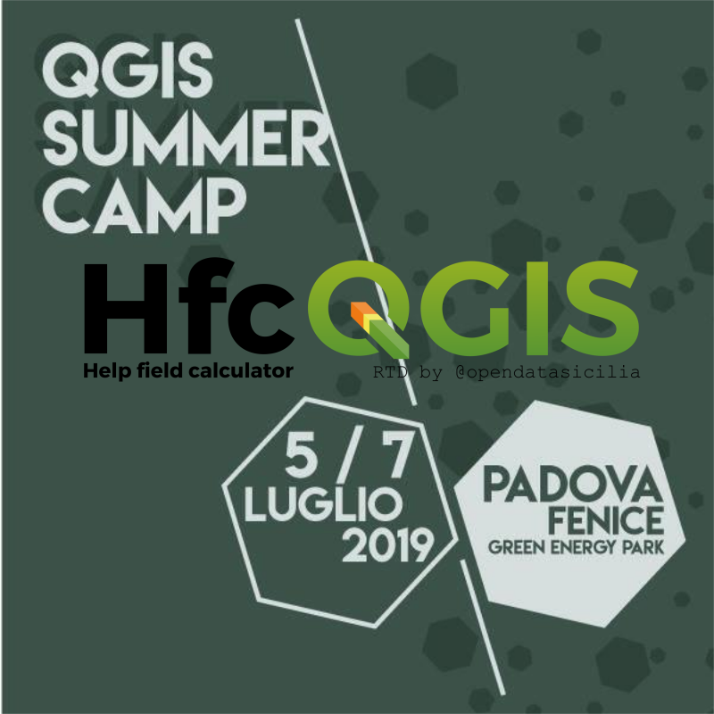
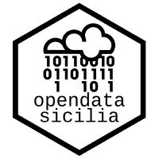

# HfcQGIS: Help funzioni calcolatore di campi di QGIS

Presentazione **[#HfcQGIS](http://hfcqgis.opendatasicilia.it/it/latest/)** al primo QGIS Summer Camp Padova 5/7 Luglio 2019

---
**HfcQGIS:** Help funzioni calcolatore di campi di QGIS
---

Questa guida nasce per rispondere alle numerose richieste di aiuto sull’uso del calcolatore di campi, a integrazione - con esempi e molti screenshot - della guida ufficiale di QGIS.

Questa versione in formato **[Read The Docs](https://docs.readthedocs.io/en/latest/index.html)** è stata realizzata dalla comunità [OpenDataSicilia](http://opendatasicilia.it), in particolare da: [Andrea Borruso](https://twitter.com/aborruso), [Totò Fiandaca](https://twitter.com/totofiandaca) e [Giovan Battista Vitrano](https://twitter.com/gbvitrano).
L'idea è stata di Giovan Battista, mentre la musa ispiratrice per la scelta di Read The Docs è [Ciro Spataro](https://twitter.com/cirospat).

**OpenDataSicilia** fa scruscio («rumore» in siciliano) qui:

* mailing list https://groups.google.com/forum/#!forum/opendatasicilia;
* sito web http://opendatasicilia.it;
* gruppo facebook https://www.facebook.com/groups/opendatasicilia/;
* account twitter http://twitter.com/opendatasicilia;
* gruppo Telegram https://t.me/opendatasicilia.

 

 

