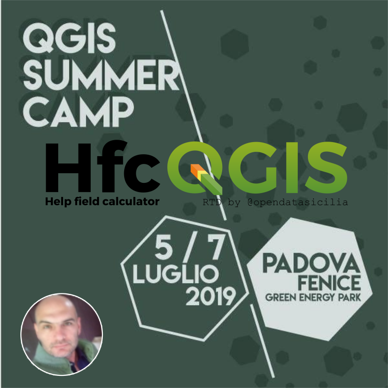
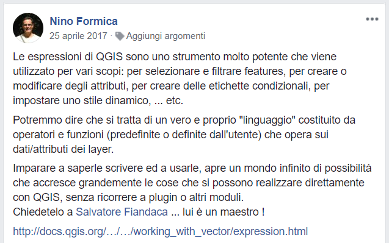
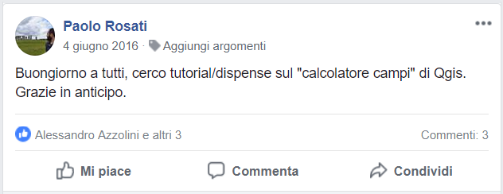
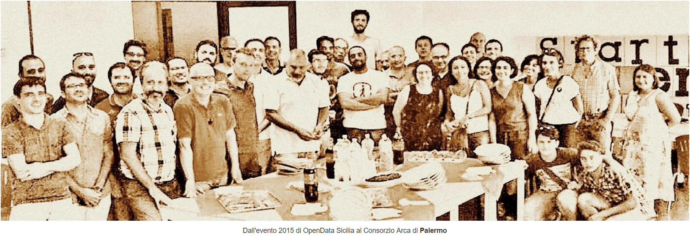
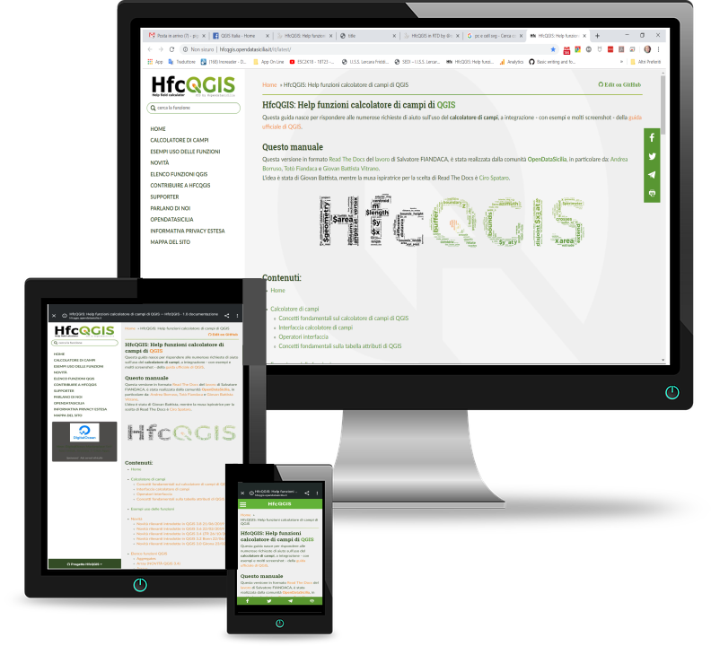
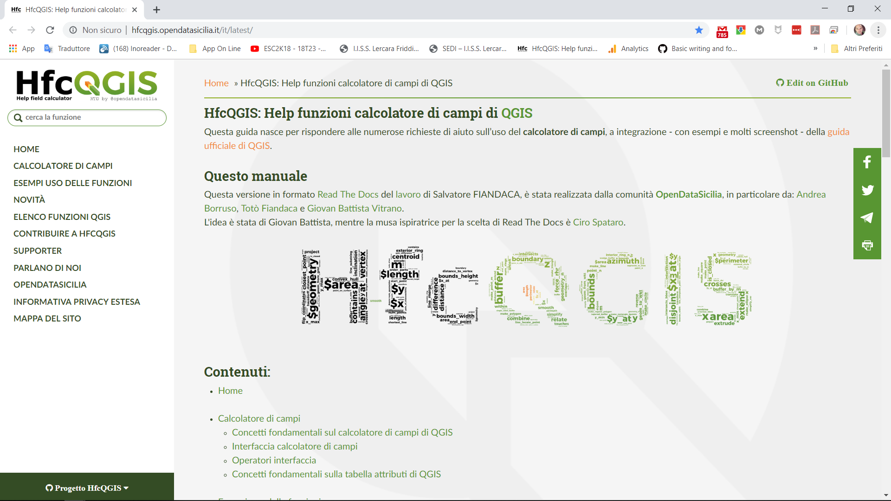
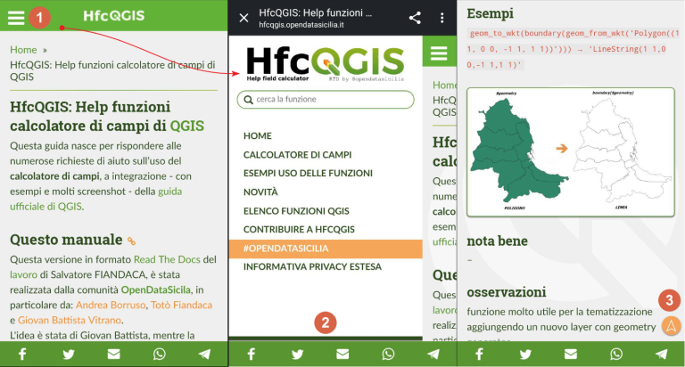
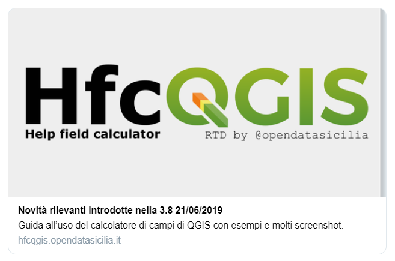

## HfcQGIS
Help funzioni calcolatore di campi di QGIS

---

Presentazione **[#HfcQGIS](http://hfcqgis.opendatasicilia.it/it/latest/)**

al primo **QGIS Summer Camp** Padova 5/7 Luglio 2019

 

---

Questa guida nasce per rispondere alle numerose richieste di aiuto sull’uso del **calcolatore di campi**, a integrazione - con esempi e molti screenshot - della guida ufficiale di **QGIS**

[Facebook](https://www.facebook.com/groups/GisItalia/permalink/10156495751381385/?comment_tracking=%7B%22tn%22%3A%22O%22%7D)

--

 

--

 

--

 

---

Questa versione in formato **[Read The Docs](https://docs.readthedocs.io/en/latest/index.html)** è stata realizzata dalla comunità [OpenDataSicilia](http://opendatasicilia.it), in particolare da: [Andrea Borruso](https://twitter.com/aborruso), [Totò Fiandaca](https://twitter.com/totofiandaca) e [Giovan Battista Vitrano](https://twitter.com/gbvitrano).
L'idea è stata di Giovan Battista, mentre la musa ispiratrice per la scelta di Read The Docs è [Ciro Spataro](https://twitter.com/cirospat).

 

---

#### OpenDataSicilia fa scruscio
(«rumore» in siciliano) qui:

* mailing list https://groups.google.com/forum/#!forum/opendatasicilia;
* sito web http://opendatasicilia.it;
* gruppo facebook https://www.facebook.com/groups/opendatasicilia/;
* account twitter http://twitter.com/opendatasicilia;
* gruppo Telegram https://t.me/opendatasicilia.

 

--

 

[Google Photos Opendatasicilia - LODS1](https://photos.google.com/share/AF1QipOY9E7G5GnRmjyR-ylXVd5aG2PTIIQqOucUIgkzP7OGCWXC1urcyXhOGTN6q2pWqA?key=Z0tZZXpUOGp0SS00UlNmQlhEcTZFaXBsRFU4bzlB)

[Google Photos Opendatasicilia -LODS2](https://photos.google.com/share/AF1QipNP-Yu1f7OVetq6dRsDjPWhk7tLMBhL2fGk_aGGCAcjth1RSYZqlUI-7CfwYvNEdA?key=dUVxVEtZM0YtVnV6MlViZFk0OGJWRmR1a1BGNTd3)

---

## Che cosa è HfcQGIS
HfcQGIS è un manuale che spiega come usare il calcolatore di campi e le relative funzioni/espressioni; nasce per rispondere alle numerose richieste di aiuto sull’uso del calcolatore di campi e per colmare un vuoto sulla guida online di QGIS con esempi e molti screenshot.

---

## Come usarlo

 

--

### link

Short link di HfcQGIS

bit.ly/hfcqgis

condividi con #hfcqgis #qgis @opendatasicilia

---

## Come è organizzata

 

--

 

---

### grazie per l'attenzione

 

